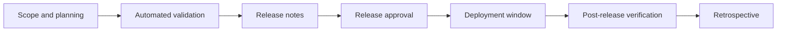

# Release readiness flow

```mermaid
flowchart LR
    Plan[Scope and planning] --> Validate[Automated validation]
    Validate --> Notes[Release notes]
    Notes --> Approval[Release approval]
    Approval --> Deploy[Deployment window]
    Deploy --> Verify[Post-release verification]
    Verify --> Review[Retrospective]
```

This flow shows the baseline operating pattern that the delivery accelerator assets are meant to reinforce.
