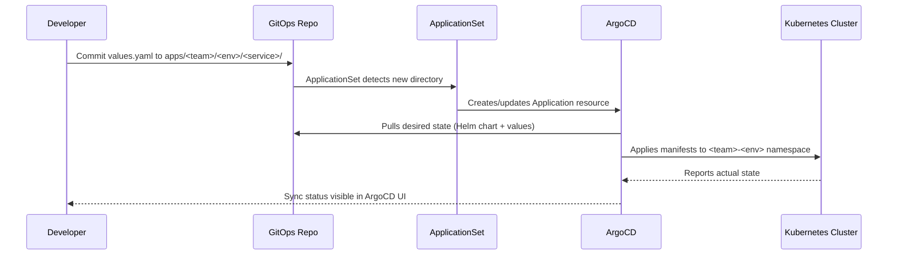

# GitOps with ArgoCD - Guide for Teams

This guide explains how to deploy and manage services using ArgoCD and the GitOps patterns established by the platform team.

## How It Works



## Getting Started

### 1. Create your team's directory

```bash
mkdir -p apps/<your-team>/dev/<service-name>
```

### 2. Add a values.yaml

```yaml
# apps/<your-team>/dev/<service-name>/values.yaml
image:
  repository: <your-ecr-account>.dkr.ecr.eu-west-1.amazonaws.com/<service>
  tag: latest   # ArgoCD Image Updater will manage this field

replicaCount: 1

resources:
  requests:
    cpu: 100m
    memory: 128Mi
  limits:
    cpu: 500m
    memory: 256Mi

livenessProbe:
  httpGet:
    path: /health
    port: 8080
  initialDelaySeconds: 10
  periodSeconds: 10

readinessProbe:
  httpGet:
    path: /ready
    port: 8080
  initialDelaySeconds: 5
  periodSeconds: 5
```

### 3. Commit and push

```bash
git add apps/<your-team>/
git commit -m "feat(gitops): onboard <service> for <team> in dev"
git push
```

ArgoCD will detect the new directory within 3 minutes and create the Application automatically. You will see it appear in the ArgoCD UI under the `<team>` project.

## Sync Policies

### Automated sync (default)

All team applications have automated sync enabled with `prune: true` and `selfHeal: true`:

- **prune**: Resources deleted from Git are deleted from the cluster
- **selfHeal**: If someone manually changes something in the cluster, ArgoCD reverts it back to the Git state

### Sync windows

Production namespaces (`<team>-prod`) have sync windows enforced:
- **Automated syncs allowed**: Monday to Friday, 08:00-18:00 UTC
- **Outside hours**: Automated syncs are blocked; manual sync via UI is available for urgent fixes

### Manual sync

To force a sync outside the window or for a specific application:
1. Open ArgoCD UI
2. Navigate to your application
3. Click **Sync** > **Synchronize**

## Directory Structure Reference

```
apps/
  <team>/
    dev/
      <service>/
        values.yaml       # Required: Helm values for dev
    staging/
      <service>/
        values.yaml       # Required: Helm values for staging
    prod/
      <service>/
        values.yaml       # Required: Helm values for prod
```

Each `values.yaml` overrides the base Helm chart values for that environment. Use environment-specific values (replica count, resource limits, ingress hostnames) here.

## Troubleshooting

### OutOfSync

The application's desired state (Git) differs from the actual state (cluster).

**Common causes:**
- A manual change was made directly in the cluster (`kubectl apply`, `kubectl edit`)
- A controller mutated a field (e.g., `spec.clusterIP` on a Service)
- The Helm chart generated different output than last sync

**Fix:** Click **Sync** in the UI to reconcile, or investigate what changed with the **Diff** view.

### Degraded

One or more resources in the application are not healthy.

**Common causes:**
- Pod crash loop (`CrashLoopBackOff`) - check pod logs
- Image pull error - verify ECR credentials and image tag exist
- Readiness probe failing - service not ready yet or health endpoint broken

**Fix:** Check `kubectl describe pod -n <team>-<env>` and pod logs for the root cause.

### Unknown

ArgoCD cannot determine the application state.

**Common causes:**
- ArgoCD lost connection to the cluster
- RBAC issue preventing ArgoCD from reading resources
- CRD not installed in the cluster

**Fix:** Check ArgoCD server logs and verify the AppProject permissions.

## Access and RBAC

| Role | Who | Permissions |
|------|-----|-------------|
| `team-admin` | Team leads | Full access to team project |
| `team-developer` | All team members | Sync dev/staging, read prod |
| `ci-robot` | CI/CD pipelines | Sync all environments (no override) |

To request access, ask your team lead to add your GitHub username to the `tata-consulting:<team>` GitHub team.
